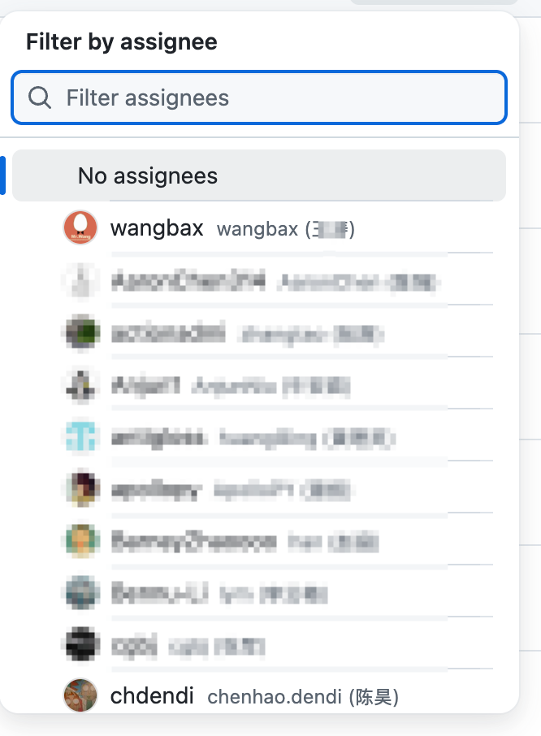
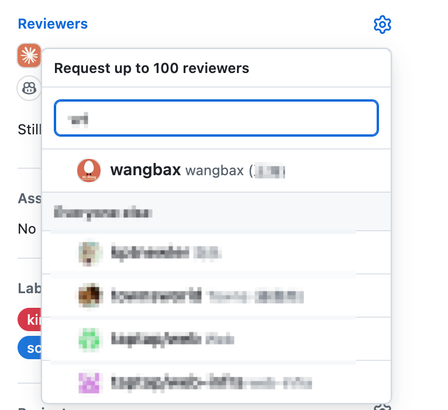

# GitHub Linker

GitHub Linker 是一个面向研发团队的浏览器插件，用来增强 GitHub 和 GitLab 的日常协作，并把代码页面中的人员、项目编号和问题单串起来。

无论你是在 GitHub 查看 PR、在 GitLab 查看 MR，还是在 Sentry 排查问题，它都能减少复制登录名、切换页面和手动查工单的步骤。

产品方向和迁移方案见：[GitHub Linker 产品方向方案](./docs/product-direction.md)。

## 为什么值得安装

- **更快找到正确的人**：在 GitHub hovercard、assignee 和 reviewer 选择器中补充团队目录里的中文名、拼音和邮箱前缀，降低“只认识登录名、不知道是谁”的沟通成本。
- **支持多个 GitHub Org**：每个 Org 可以配置自己的用户目录仓库，插件会从当前仓库地址自动识别 Org，不需要反复切换配置。
- **让代码和项目保持关联**：开启可选的飞书项目关联后，Commit、Issue 和 PR 中的 `#XX-xxx`、`#M-xxx`、`#F-xxx` 等编号可以直接跳转到对应项目，并根据 `fix`、`feat` 等提交类型识别 Issue 或 Story。
- **缩短故障处理路径**：在 Sentry Issue 页面直接创建飞书工单，自动带入标题、描述和问题 URL，减少复制粘贴。
- **不改变现有工作方式**：GitHub 用户映射和搜索增强无需配置飞书；飞书、GitLab 和 Sentry 能力都放在“更多设置”中，按需启用。

## 主要功能

### GitHub/GitLab 核心增强
- 👤 **团队成员识别**：基于用户目录仓库中的 `GitHub / Name / Email` 映射，在 GitHub 原生 hovercard 中补充中文名。
- 👥 **多 Org 用户映射**：按当前仓库所属 Org 自动加载对应目录。
- 🔎 **Assignee/Reviewer 搜索增强**：支持中文名、拼音和邮箱前缀搜索。
- 🚀 **页面自动适配**：支持 GitHub Turbo 导航、标签切换和动态加载内容。
- 🌐 **多平台支持**：支持 GitHub 和 GitLab。

### 更多设置
- 🔗 **飞书项目关联**：可选开启，将项目编号转换为飞书项目链接。
- 🎯 **智能类型识别**：根据 commit 类型前缀判断 Issue 或 Story。
- 🧩 **Sentry 工单关联**：在 Sentry Issue 页面创建并回填飞书工单。

## 功能预览

### GitHub Org 配置
<p align="center">
  
</p>

支持添加多个 GitHub Org，并根据用户目录仓库地址自动识别 Org 登录名。首次安装只配置 GitHub Org 即可使用核心增强能力。

### Assignee/Reviewer 搜索增强
<p align="center">
  
  
</p>

## 安装

### 商店安装

[Chrome 应用商店](https://chromewebstore.google.com/detail/lark-project-linker/kekfhompghbimkcldfjjdhmgnnfkmfbd?authuser=0&hl=zh-CN)

### 本地开发安装

#### 1. 克隆项目

```bash
git clone https://github.com/wangbax/git-project-linker.git
cd git-project-linker
```

#### 2. 安装依赖

要求：Node.js >= 18

```bash
# 使用 yarn（推荐）
yarn install

# 或使用 npm
npm install
```

#### 3. 构建项目

```bash
# 使用 yarn
yarn build

# 或使用 npm
npm run build
```

构建完成后，产物会生成在 `dist` 目录中。

#### 4. 在浏览器中加载扩展

##### Chrome/Edge 浏览器

1. 打开浏览器，访问扩展管理页面：
   - Chrome: `chrome://extensions/`
   - Edge: `edge://extensions/`

2. 开启右上角的「开发者模式」

3. 点击「加载已解压的扩展程序」

<p align="center">
  
</p>

4. 选择项目的 `dist` 文件夹，扩展安装成功！

## 配置

安装完成后，点击扩展图标或在扩展管理页面点击「选项」进行配置

### GitHub 配置
- **GitHub 增强**：默认启用，不依赖飞书配置
- **GitHub Org**：可添加多个 Org，每个 Org 配置自己的用户目录仓库
  - 例如：填写 `https://github.com/xindong/org`，插件会自动识别 Org 为 `xindong`
  - 插件根据当前仓库 URL 自动选择对应 Org 的映射
- **用户目录格式**：目录仓库 README 需要包含 `GitHub / Name / Email` 表格
  - `Name` 会显示在 GitHub 原生 hovercard 中
  - Issue/PR assignee 搜索支持 Name、中文名拼音和邮箱前缀

### 更多设置

默认折叠，包含可选能力：

- **飞书项目关联**：默认关闭。开启后可配置飞书命名空间、项目编号前缀和项目链接跳转
- **GitLab 域名**：用于匹配自建 GitLab 域名，多个域名用逗号分隔
- **Sentry 工单关联**：配置 Sentry 域名和后端 API 地址后启用

飞书关联关闭时，GitHub Org、用户映射和 assignee/reviewer 搜索增强仍然可用。

## 使用场景

### GitLab/GitHub 使用

#### Merge Request/Pull Request 标题
```
fix: [AutoTest] Android 三方授权页面顶部无 title #XX-6581113659
                                              ↓
                                   自动识别为 Issue
```

#### Commit 列表
```
feat: 新增分享功能 #XX-123456789
                ↓
        自动识别为 Story
```

#### GitHub 页面示例

在 GitHub 仓库、Issue 或 PR 页面中：

- 👤 根据当前 Org 在 hovercard 中显示用户中文名
- 🔎 assignee/reviewer 搜索支持中文名、拼音和邮箱前缀
- 🔄 GitHub Turbo 导航后自动切换当前 Org 映射

如果在“更多设置”中启用飞书关联，Commit、Issue 和 PR 中的项目编号还可以跳转到飞书项目。

#### 页面自动刷新
- ✅ 切换到 Commits 标签 → 自动扫描新链接
- ✅ 切换到 Changes 标签 → 自动扫描新链接
- ✅ 浏览器前进/后退 → 自动扫描新链接
- ✅ GitHub Turbo 导航 → 自动扫描新链接

### Sentry 使用

#### 快速创建飞书工单

1. 打开任意 Sentry Issue 页面
2. 在 Issue Tracking 区域找到"Feishu Issue"按钮
3. 点击"+"按钮打开创建工单弹窗
4. 弹窗会自动填充：
   - **标题**：Sentry 异常信息（带 `[Sentry]` 前缀）
   - **描述**：包含异常堆栈、环境、版本等信息
   - **报告人**：当前登录的 Sentry 用户（可搜索修改）
   - **经办人**：可搜索 Sentry 成员
   - **动态字段**：优先级、严重程度等（根据后端配置）
5. 填写完毕后点击"创建"
6. 创建成功后页面会自动显示工单号（如 `XX-6663198368`），点击可跳转

#### 查看已创建的工单

如果 Sentry Issue 已关联飞书工单：
- 按钮会显示工单号（如 `XX-6663148821`）
- 点击工单号直接跳转到飞书工单详情
- "+"按钮会被隐藏，避免重复创建

## 开发说明

### 目录结构

```
├── dist/               # 构建产物
├── src/
│   ├── js/            # JavaScript 源码
│   │   ├── index.js           # 主入口，核心通用功能
│   │   ├── gitlab-handler.js  # GitLab 平台处理器
│   │   ├── github-handler.js  # GitHub 平台处理器
│   │   ├── background.js      # 后台脚本
│   │   ├── sentry.js          # Sentry 内容脚本
│   │   ├── options.js         # 配置页面
│   │   ├── store.js           # 配置存储与缓存管理
│   │   ├── utils.js           # 工具函数
│   │   └── event.js           # 事件常量
│   ├── html/          # HTML 页面
│   └── assets/        # 静态资源
├── gulpfile.js        # 构建配置
└── package.json
```

### 开发模式

```bash
# 监听文件变化并自动构建
npm run watch
```

修改代码后，需要在浏览器扩展管理页面点击「重新加载」按钮。

### 代码架构

项目采用模块化架构，平台特定逻辑独立管理：

```
┌─────────────────────────────────────────────┐
│              index.js (主入口)               │
│  - 初始化配置和缓存                          │
│  - 提供核心功能（Popover、链接生成等）      │
│  - 监听通用事件                              │
│  - 初始化平台处理器                          │
└────────────┬────────────────────────────────┘
             │ 使用
             ↓
┌────────────────────────┐
│     store.js           │
│  - 配置管理            │
│  - 缓存管理            │
└────────────────────────┘

             │ 创建处理器
     ┌───────┴────────┐
     ↓                ↓
┌──────────────┐  ┌──────────────┐
│gitlab-handler│  │github-handler│
│   GitLab     │  │   GitHub     │
│   平台处理   │  │   平台处理   │
└──────────────┘  └──────────────┘
```

### 添加新平台支持

添加新平台只需3步：

#### 1. 创建处理器文件
```javascript
// src/js/bitbucket-handler.js
export function createBitbucketHandler(context) {
  function init() {
    // 初始化逻辑
  }
  
  return { init };
}
```

#### 2. 导入处理器
```javascript
// src/js/index.js
import { createBitbucketHandler } from "./bitbucket-handler";
```

#### 3. 初始化处理器
```javascript
// src/js/index.js
const isBitbucket = window.location.host.includes('bitbucket');

if (isBitbucket) {
  platformHandler = createBitbucketHandler(context);
  platformHandler.init();
}
```

### 调试技巧

#### 查看缓存
```javascript
// 在浏览器控制台中
chrome.storage.local.get('LARK_PROJECT_TYPE_CACHE', (result) => {
  console.log(result);
});
```

#### 清除缓存
```javascript
// 在浏览器控制台中
chrome.storage.local.remove('LARK_PROJECT_TYPE_CACHE');
```

## 更新日志

详细版本记录已迁移到 [CHANGELOG.md](./CHANGELOG.md)。

## 贡献指南

1. Fork 项目
2. 创建功能分支 (`git checkout -b feature/AmazingFeature`)
3. 提交更改 (`git commit -m 'Add some AmazingFeature'`)
4. 推送到分支 (`git push origin feature/AmazingFeature`)
5. 开启 Pull Request

## 许可证

MIT License
